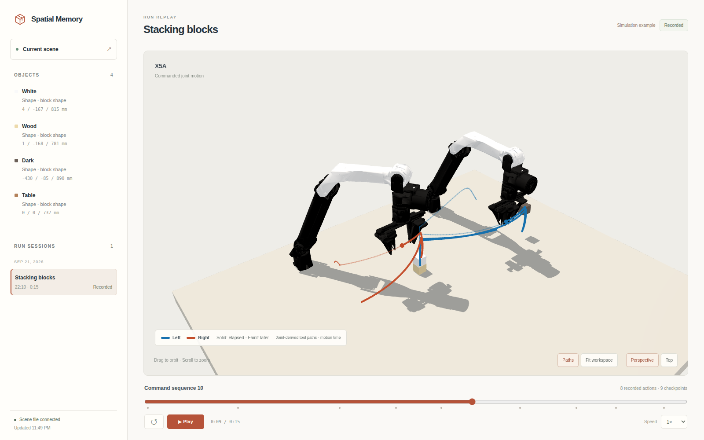

# Spatial Memory

**Spatial memory for faster agent-as-policy robot control.**

General-purpose agents are starting to control robots through images, reasoning,
and tool calls. Recent [GPT-6 Astra robot demonstrations](https://openai.robocurve.org/gpt-6-astra/)
and [Agent as Policy experiments](https://agent-as-policy-2026.github.io/)
show what this makes possible: an agent can interpret a task, write code, command
robot arms, and adjust its actions from feedback, without training a new policy
for each task.

But this flexibility is often very slow. Each round of observation, reasoning,
and code generation adds time between actions; the Agent as Policy experiments
report successful tasks taking tens of minutes. Repeatedly working out object
geometry and rewriting spatial calculations adds work to that loop.

Spatial Memory targets that repeated spatial work. Build a 3D scene once, then
update what changes. The agent reuses stored object geometry and calls existing
geometry scripts to calculate subsequent targets, reducing repeated reconstruction
and code generation.

The approach has two parts:

1. **Maintain a 3D reconstruction during execution.** The agent describes object
   shapes at the start. The scene retains their geometry, dimensions, and spatial
   relationships; new observations update their placement as the robot acts.
2. **Estimate positions with a predefined geometry library.** The agent selects
   image measurements. Existing scripts use camera calibration to calculate
   positions, orientations, and dimensions, then save the results in the scene.
   Later actions reuse these scripts and the saved geometry.

[Architecture](OVERVIEW.md) · [Agent skill](skills/spatial-memory/SKILL.md) · [Project page](https://darthjaja6.github.io/spatial_memory/)

## Demo: spatial memory during a task

[](docs/assets/stacking.mp4)

[Watch the replay](docs/assets/stacking.mp4): two ARX X5 arms stack blocks while
the viewer shows their motion, tool paths, and changes to remembered object poses.
The same block shape is reused across instances and throughout the task.

This simulation recording follows saved motion time at 1×. It shows nine saved
scene updates; object motion between those updates is not reconstructed.
Decision time and token savings have not yet been measured.

## Try the viewer

Use **Python 3.11**. From the repository root:

```bash
python -m venv .venv
source .venv/bin/activate
python -m pip install -r requirements.txt
python demo/app.py
```

Open **http://127.0.0.1:8765** to explore the [included recorded example](examples/stacking/). Its
objects are scene estimates, not physical ground truth. The viewer is read-only
and needs no robot connection, simulator, GPU, or model account.

To inspect your own scene and recordings:

```bash
python demo/app.py --scene /path/to/workspace/scene.json --runs /path/to/runs
```

The viewer displays scene geometry and recorded sessions, including trajectories
and checkpoints when present. See the [viewer data format](skills/spatial-memory/references/visualize.md).

## Edit a scene yourself

From the repository root, copy the recorded scene and its geometry into a new
working directory. This example reads the white block's dimensions, moves its
scene estimate 10 cm along world x, and opens the result:

```bash
mkdir -p runs/my-scene
cp examples/stacking/scene.json runs/my-scene/
cp -R examples/stacking/assets examples/stacking/robot runs/my-scene/
printf '%s\n' '{"object":"white"}' | \
  python skills/spatial-memory/scripts/scene.py geometry --scene runs/my-scene/scene.json
python skills/spatial-memory/scripts/assets.py transform \
  --scene runs/my-scene/scene.json --object white --translate 0.1 0 0
python demo/app.py --scene runs/my-scene/scene.json --port 8766
```

Open **http://127.0.0.1:8766**. Further edits refresh the live view. To start a
scene from scratch, see [scene setup](skills/spatial-memory/references/scene.md#command-setup-and-coordinates).

## Give an agent spatial memory

Copy the **complete skill folder**, including its scripts, references, and assets,
into your agent's workspace:

```bash
mkdir -p /path/to/your/workspace/.agents/skills
cp -R skills/spatial-memory /path/to/your/workspace/.agents/skills/
```

Ask the agent to use `spatial-memory`, with access to a Python environment containing
the dependencies above. The workflow is to describe the scene, fit geometry to
observations, use that model to choose actions, and revise it when new evidence arrives.

The geometry tools also work directly. For example, fit a plane through three
points, expressed in metres:

```bash
printf '%s\n' '{"points":[[0,0,0],[1,0,0],[0,1,0]]}' | \
  python skills/spatial-memory/scripts/geometry.py plane
```

## What is included

| Part | Start here |
| --- | --- |
| Agent workflow | [`skills/spatial-memory/`](skills/spatial-memory/SKILL.md) |
| Reusable shapes and landmarks | [Asset format](skills/spatial-memory/references/modeling.md) |
| Scene state, metric fitting, and measurements | [Scene commands](skills/spatial-memory/references/scene.md) |
| Projections, transforms, and kinematics | [Geometry commands](skills/spatial-memory/references/geometry.md) |
| Browser viewer | [`demo/`](demo/) |
| Optional robot integration | [RoboDojo setup](integrations/robodojo/astra_agent/README.md) |

### Optional robot motion

A robot deployment supplies its model, observations, calibration, measured joints,
and controller interface. The included SO-101 model is geometry; connecting and
controlling a robot requires a deployment adapter. Start with the
[own-robot adapter guide](skills/spatial-memory/references/execution.md#connect-your-own-robot).

For the joint planner, install the additional dependencies:

```bash
python -m pip install -r requirements-motion.txt
```

It combines Drake inverse kinematics, MPlib/OMPL path planning, and TOPPRA timing
for configured fixed-base robots with bounded revolute or prismatic joints.
Continuous, floating, and planar joints are unsupported. Collision checks depend on
the supplied geometry. Orientation constraints apply at targets; continuous
orientation constraints are not implemented. See the [execution guide](skills/spatial-memory/references/execution.md).

## Documentation and development

The static project site lives in [`docs/`](docs/) and can be published directly
with GitHub Pages. Preview it locally:

```bash
python -m http.server 8080 --directory docs
```

Open **http://localhost:8080**. To run the local tests:

```bash
python -m unittest discover -s tests
```

Planner tests skip when optional dependencies are unavailable. Contributions are
welcome; include a reproducible example for bugs and relevant validation for changes.

This is a research toolkit. Geometry estimates depend on model assumptions,
image correspondences, and calibration; a good image fit alone does not establish
physical accuracy. The included recordings illustrate the workflow and do not
establish a benchmark or reliability result.

## License

Original code is licensed under [MIT](LICENSE). Bundled [SO-101 geometry](skills/spatial-memory/assets/so101/SOURCE.md)
retains Apache-2.0, and [Three.js](demo/vendor/SOURCE.md) retains MIT.
The recorded example includes [ARX X5 geometry](examples/stacking/robot/SOURCE.md) under MIT. The RoboDojo
patch retains its [upstream MIT notice](integrations/robodojo/ROBODOJO-LICENSE).
